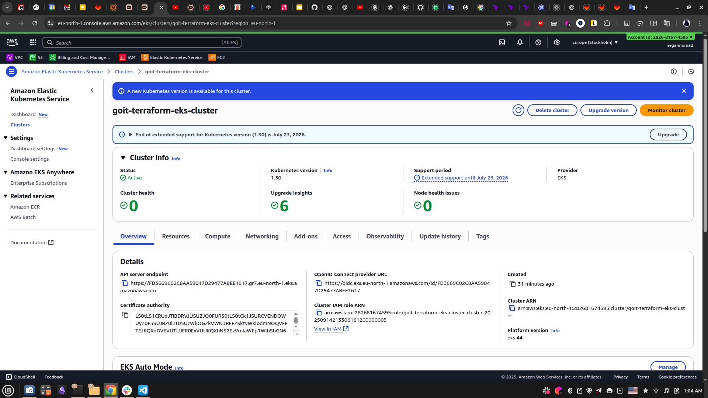

# EKS VPC Cluster Infrastructure

Terraform Infrastructure as Code для розгортання VPC та Kubernetes кластера в AWS.

## Опис проекту

Цей проект містить модульну Terraform конфігурацію для автоматичного розгортання повноцінної інфраструктури AWS, що включає:

- **VPC** - віртуальна приватна мережа з публічними та приватними підмережами
- **EKS Cluster** - Kubernetes кластер з двома нод-пулами (CPU&GPU).

## Архітектура

```
eks-vpc-cluster/
├── main.tf                    # оголошення модулів vpc та eks
├── variables.tf               # оголошення змінних
├── outputs.tf                 # оголошення вихідних даних
├── terraform.tf               # оголошення платформи та провайдера
├── backend.tf                 # оголошення бекенду
├── terraform.tfvars           # оголошення значень змінних
├── vpc/
│   ├── main.tf                # оголошення модуля vpc
│   ├── variables.tf           # оголошення змінних
│   ├── outputs.tf             # оголошення вихідних даних
│   ├── terraform.tf           # оголошення платформи
│   └── backend.tf             # зарезервовано згідно умов ДЗ
├── eks/
│   ├── main.tf                # оголошення модуля eks
│   ├── variables.tf           # оголошення змінних
│   ├── outputs.tf             # оголошення вихідних даних
│   ├── terraform.tf           # оголошення платформи
│   └── backend.tf             # зарезервовано згідно умов ДЗ
└── README.md

```

## Передумови

- **Terraform** >= 1.13
- **AWS CLI** налаштований з відповідними правами доступу
- **kubectl** для роботи з Kubernetes

## Конфігурація

### Node Groups:

#### CPU Node Group:

- **Instance Types**: `t3.micro`
- **Desired Capacity**: 2
- **Min/Max Capacity**: 0-3

#### GPU Node Group:

- **Instance Types**: `t3.small` (імітація для збереження бюджету)
- **Desired Capacity**: 0
- **Min/Max Capacity**: 0-1

## Запуск проекту

### 1. Ініціалізація Terraform

```bash
terraform init
```

### 2. Перегляд майбутніх змін

```bash
terraform plan
```

### 3. Розгортання інфраструктури

```bash
terraform apply
```

### 4. Налаштування kubectl

```bash
aws eks update-kubeconfig --region us-east-1 --name goit-terraform-eks-cluster
```

### 5. Перевірка кластера

```bash
kubectl get nodes
kubectl get pods -n kube-system
```

## Модулі

### VPC Модуль

- Створює VPC з публічними та приватними підмережами
- Налаштовує Internet Gateway та NAT Gateway
- Конфігурує маршрутизацію та Security Groups

### EKS Модуль

- Розгортає EKS Control Plane
- Створює CPU$GPU нод-пули
- Встановлює необхідні add-ons


## Очищення ресурсів

```bash
terraform destroy
```

# Proofs

**1. Створений кластер**



**2. Створені групи нодів та ноди**


**3. Створені ролі доступу**


**4. Створені поди**


**5. Створені аддони**


**6. Результат виконання статусних команд kubectl**

